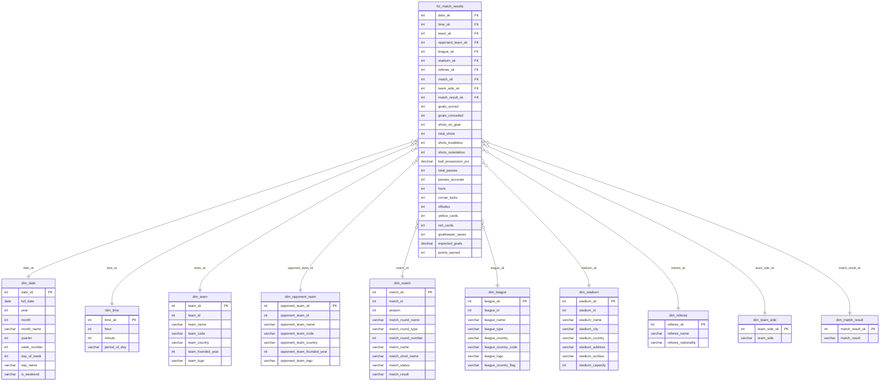

# Superligaen Data Engineering Demo

An end-to-end data engineering project for Danish premier football league (Superligaen) — from raw API ingestion to a live analytics dashboard. Built on a fully custom Python + SQL stack.

**Live dashboard →** [superligaen.pages.dev](https://superligaen.pages.dev)

---

## Architecture

```
api-football.com
       │
       ▼
  Bronze layer        Raw JSON stored in MotherDuck (one table per endpoint)
       │
       ▼
  Silver layer        Cleaned, typed, structured relational tables
       │
       ▼
  Gold layer          Kimball star schema  ─────────────────────────────┐
                      (dims + fct_match_results)                         │
                                                                         ▼
                                                              Evidence.dev dashboard
                                                              deployed on Cloudflare Pages
```

The nightly GitHub Actions pipeline runs all three layers sequentially, then triggers a Cloudflare Pages rebuild so the dashboard always reflects last night's data.

---

## Tech stack

| Layer | Tool |
|---|---|
| Data warehouse | MotherDuck (DuckDB cloud) |
| Ingestion | Python (`ingestion/`) |
| Transformations | Pure SQL + Python runners (`transformations/`) |
| Orchestration | GitHub Actions (nightly + manual triggers) |
| BI / Dashboard | Evidence.dev |
| Hosting | Cloudflare Pages |

---

## Data model

The gold layer follows **Kimball dimensional modelling**. Fact grain: **one row per team per match** (each fixture produces two rows — one for the home team, one for the away team).



All dimension surrogate keys are **stable across runs** — new records get new SKs, existing records keep theirs. Sentinel rows (`-1 Unknown`, `-2 Not Applicable`) handle missing lookups.

---

## Dashboard pages

| Page | Description |
|---|---|
| **Home** | Season KPIs, current leader, navigation |
| **Standings** | Championship, Relegation & Regular Season tables |
| **Match Results** | Full match history, scorelines, Goals vs xG by round |
| **Team Analytics** | Deep-dive per-team KPIs, form, shooting, possession, discipline |
| **Upcoming Fixtures** | Next fixtures with head-to-head history and last-5 form guide |

---

## Project structure

```
.
├── ingestion/                  # Bronze: pull from api-football.com → MotherDuck
│   ├── run.py                  # Ingestion runner (incremental + full load)
│   ├── api.py                  # API client
│   ├── db.py                   # MotherDuck connection
│   ├── config.py               # Config and env vars
│   └── ingest_*.py             # Per-entity ingestion scripts
│
├── transformations/
│   ├── run_silver.py           # Silver runner
│   ├── run_gold.py             # Gold runner
│   ├── silver/                 # Silver SQL — one file per entity
│   └── gold/                   # Gold SQL — dims and fact table
│
├── dashboards/                 # Evidence.dev BI app
│   ├── pages/                  # One .md file per dashboard page
│   └── sources/superligaen/    # SQL sources compiled to parquet
│
├── .github/workflows/
│   ├── master.yml              # Nightly: bronze → silver → gold → deploy
│   ├── cloudflare.yml          # Manual deploy trigger
│   ├── ingest.yml              # Manual bronze-only run
│   ├── transform.yml           # Manual silver-only run
│   └── gold.yml                # Manual gold-only run
│
└── requirements.txt
```

---

## Environments

| Environment | MotherDuck database | Triggered by |
|---|---|---|
| Dev | `superligaen_dev` | Local / feature branches |
| Prod | `superligaen` | GitHub Actions (`main`) |

---

## Local setup

```bash
# 1. Clone and create a feature branch
git clone https://github.com/SaUgKi1773/data-engineering-demo.git
git checkout -b dev/<your-feature>

# 2. Create virtual environment
python3.11 -m venv .venv
source .venv/bin/activate
pip install -r requirements.txt

# 3. Configure environment
cp .env.example .env
# Fill in MOTHERDUCK_TOKEN and API_FOOTBALL_KEY

# 4. Run layers against dev
python ingestion/run.py
python transformations/run_silver.py
python transformations/run_gold.py

# 5. Run the dashboard locally
cd dashboards
# Write the MotherDuck token for Evidence
echo "token: $(echo -n "$MOTHERDUCK_TOKEN" | base64)" > sources/superligaen/connection.options.yaml
npm install
npm run sources
npm run dev
# → http://localhost:3000
```

---

## GitHub Actions secrets

| Secret | Description |
|---|---|
| `MOTHERDUCK_TOKEN` | MotherDuck service token (read-write) |
| `MOTHERDUCK_TOKEN_READONLY` | MotherDuck read-only token (dashboard) |
| `API_FOOTBALL_KEY` | api-football.com API key |
| `CLOUDFLARE_DEPLOY_HOOK` | Cloudflare Pages deploy hook URL |
