# Football Analytics Platform

An end-to-end data engineering project tracking the Danish Superliga — from raw API ingestion through a Kimball warehouse to a live analytics dashboard.

**Live dashboard →** [superligaanalytics.vercel.app](https://superligaanalytics.vercel.app/)

---

## Architecture

```
Sportmonks API        Groq LLM        Poisson prediction model
       │                   │                    │
       └─────────┬─────────┴────────────────────┘
                 ▼
  Bronze layer        Raw JSON stored in MotherDuck (one table per endpoint)
                       + LLM-generated match discussion rows
                       + pre-kickoff match predictions (frozen, never revised)
       │
       ▼
  Silver layer        Cleaned, typed, structured relational tables  (dbt)
       │
       ▼
  Gold layer          Kimball star schema  ─────────────────────────────┐
                      (dims + fct_team_matches                          │
                           + fct_player_appearances                     │
                           + fct_match_predictions                      │
                           + fct_match_discussions                      │
                           + fct_team_transfers)  (dbt)                 │
                                                                        ▼
                                                          Evidence.dev dashboard
                                                          (Superliga)
                                                          deployed on Vercel
```

The nightly GitHub Actions pipeline runs the three bronze producers in parallel (API ingestion, LLM discussions, match predictions), then silver and gold sequentially with data-quality tests, and finally triggers a Vercel rebuild so the dashboard always reflects last night's data.

---

## Tech stack

| Layer | Tool |
|---|---|
| Data source | Sportmonks REST API |
| Data warehouse | MotherDuck (DuckDB cloud) |
| Ingestion | Python (`ingestion/sportmonks/`, `ingestion/groq/`, `ingestion/datascience/`) |
| Match predictions | In-house Poisson goals model (`ingestion/datascience/predict_match_outcomes.py`) |
| Transformations | dbt-duckdb (`dbt/`) |
| Orchestration | GitHub Actions (nightly + manual triggers) |
| BI / Dashboard | Evidence.dev |
| Hosting | Vercel |

---

## Data model

The gold layer follows **Kimball dimensional modelling**. Five fact tables cover five business processes:

- **`fct_team_matches`** — one row per team per match (each fixture produces two rows, one per side); team-level stats, results, and tactical data
- **`fct_player_appearances`** — one row per player per match; individual performance stats and ratings
- **`fct_match_predictions`** — one row per team per predicted fixture (mirroring `fct_team_matches` grain); pre-kickoff win/draw/loss probabilities, expected goals and expected points from the Poisson model, frozen three hours before kickoff and never revised — powering the Prediction Module page
- **`fct_match_discussions`** — one row per match per persona; LLM-generated fan discussion comments (via Groq) powering the Fan Forum on the Match Analysis page
- **`fct_team_transfers`** — one row per club per transfer; incoming/outgoing moves with fee, type, status, transfer partner, and player, powering the Transfer Intelligence page

```mermaid
erDiagram
    fct_team_matches {
        int date_sk FK
        int time_sk FK
        int match_sk FK
        int team_sk FK
        int opponent_team_sk FK
        int league_sk FK
        int stadium_sk FK
        int referee_sk FK
        int coach_sk FK
        int formation_sk FK
        int team_side_sk FK
        int match_result_sk FK
        int goals_scored
        int goals_conceded
        int goals_ht_scored
        int goals_ht_conceded
        decimal ball_possession_pct
        int corner_kicks
        int yellow_cards
        int red_cards
        int saves
        int fouls
        int offsides
        int points_earned
    }

    fct_player_appearances {
        int date_sk FK
        int time_sk FK
        int match_sk FK
        int player_sk FK
        int team_sk FK
        int opponent_team_sk FK
        int league_sk FK
        int stadium_sk FK
        int referee_sk FK
        int coach_sk FK
        int formation_sk FK
        int position_sk FK
        int team_side_sk FK
        int match_result_sk FK
        int appearance_type_sk FK
        int minutes_played
        int goals_scored
        int assists
        int shots_total
        int shots_on_target
        int passes_total
        int passes_accurate
        int key_passes
        int tackles
        int interceptions
        int clearances
        int saves
        int yellow_cards
        int red_cards
        int fouls_committed
        decimal rating
    }

    dim_date {
        int date_sk PK
        date date
        int year
        int month
        varchar month_name
        int quarter
        int week_number
        int day_of_week
        varchar day_name
        boolean is_weekend
        varchar season
        boolean is_current_season
    }

    dim_time {
        int time_sk PK
        int hour
        int minute
        varchar period_of_day
    }

    dim_match {
        int match_sk PK
        int match_id
        varchar match_round_type
        varchar match_round_name
        int match_round_number
        varchar match_name
        varchar match_short_name
        varchar match_type
        varchar match_status
        varchar match_result
        varchar kick_off_time
    }

    dim_team {
        int team_sk PK
        int team_id
        varchar team_name
        varchar team_code
        varchar team_short_name
        varchar team_country
        int team_founded_year
        varchar team_logo
        varchar team_venue_name
        varchar team_venue_city
        int team_venue_capacity
    }

    dim_opponent_team {
        int opponent_team_sk PK
        int opponent_team_id
        varchar opponent_team_name
        varchar opponent_team_code
        varchar opponent_team_short_name
        varchar opponent_team_country
        varchar opponent_team_logo
    }

    dim_league {
        int league_sk PK
        int league_id
        varchar league_name
        varchar league_type
        varchar league_country
        varchar league_country_code
        varchar league_logo
        varchar league_country_flag
    }

    dim_stadium {
        int stadium_sk PK
        int stadium_id
        varchar stadium_name
        varchar stadium_city
        varchar stadium_country
        varchar stadium_surface
        int stadium_capacity
    }

    dim_referee {
        int referee_sk PK
        int referee_id
        varchar referee_common_name
        varchar referee_firstname
        varchar referee_lastname
        varchar referee_nationality
    }

    dim_coach {
        int coach_sk PK
        int coach_id
        varchar coach_display_name
        varchar coach_nationality
    }

    dim_formation {
        int formation_sk PK
        varchar formation
    }

    dim_player {
        int player_sk PK
        int player_id
        varchar player_name
        varchar player_nationality
        date player_birth_date
        varchar player_position
        varchar player_detailed_position
        int player_height
        int player_weight
        varchar player_photo
    }

    dim_position {
        int position_sk PK
        varchar position_name
        varchar position_short_code
        varchar position_group
    }

    dim_team_side {
        int team_side_sk PK
        varchar team_side
    }

    dim_match_result {
        int match_result_sk PK
        varchar match_result
    }

    dim_appearance_type {
        int appearance_type_sk PK
        varchar appearance_type
    }

    dim_persona {
        int persona_sk PK
        varchar persona_name
        int sort_order
        boolean is_active
        varchar bio
    }

    fct_match_discussions {
        int match_sk FK
        int persona_sk FK
        int date_sk FK
        varchar message
    }

    dim_transfer_type {
        int transfer_type_sk PK
        varchar transfer_type_name
        varchar transfer_direction
    }

    dim_transfer_status {
        int transfer_status_sk PK
        varchar transfer_status
    }

    dim_transfer_partner_team {
        int transfer_partner_team_sk PK
        int transfer_partner_team_id
        varchar transfer_partner_team_name
        varchar transfer_partner_team_country
        varchar transfer_partner_team_logo
    }

    fct_team_transfers {
        int transfer_id
        int date_sk FK
        int team_sk FK
        int transfer_partner_team_sk FK
        int player_sk FK
        int transfer_type_sk FK
        int transfer_status_sk FK
        int transfer_count
        int transfer_fee_eur
    }

    fct_match_predictions {
        int date_sk FK
        int match_sk FK
        int team_sk FK
        int opponent_team_sk FK
        int league_sk FK
        int team_side_sk FK
        decimal win_probability
        decimal draw_probability
        decimal loss_probability
        decimal predicted_goals_scored
        decimal predicted_goals_conceded
        decimal predicted_points
        varchar model_version
        timestamp predicted_at
    }

    fct_team_matches }o--|| dim_date : "date_sk"
    fct_team_matches }o--|| dim_time : "time_sk"
    fct_team_matches }o--|| dim_match : "match_sk"
    fct_team_matches }o--|| dim_team : "team_sk"
    fct_team_matches }o--|| dim_opponent_team : "opponent_team_sk"
    fct_team_matches }o--|| dim_league : "league_sk"
    fct_team_matches }o--|| dim_stadium : "stadium_sk"
    fct_team_matches }o--|| dim_referee : "referee_sk"
    fct_team_matches }o--|| dim_coach : "coach_sk"
    fct_team_matches }o--|| dim_formation : "formation_sk"
    fct_team_matches }o--|| dim_team_side : "team_side_sk"
    fct_team_matches }o--|| dim_match_result : "match_result_sk"
    fct_player_appearances }o--|| dim_date : "date_sk"
    fct_player_appearances }o--|| dim_time : "time_sk"
    fct_player_appearances }o--|| dim_match : "match_sk"
    fct_player_appearances }o--|| dim_player : "player_sk"
    fct_player_appearances }o--|| dim_team : "team_sk"
    fct_player_appearances }o--|| dim_opponent_team : "opponent_team_sk"
    fct_player_appearances }o--|| dim_league : "league_sk"
    fct_player_appearances }o--|| dim_stadium : "stadium_sk"
    fct_player_appearances }o--|| dim_referee : "referee_sk"
    fct_player_appearances }o--|| dim_coach : "coach_sk"
    fct_player_appearances }o--|| dim_formation : "formation_sk"
    fct_player_appearances }o--|| dim_position : "position_sk"
    fct_player_appearances }o--|| dim_team_side : "team_side_sk"
    fct_player_appearances }o--|| dim_match_result : "match_result_sk"
    fct_player_appearances }o--|| dim_appearance_type : "appearance_type_sk"
    fct_match_discussions }o--|| dim_match : "match_sk"
    fct_match_discussions }o--|| dim_persona : "persona_sk"
    fct_match_discussions }o--|| dim_date : "date_sk"
    fct_team_transfers }o--|| dim_date : "date_sk"
    fct_team_transfers }o--|| dim_team : "team_sk"
    fct_team_transfers }o--|| dim_transfer_partner_team : "transfer_partner_team_sk"
    fct_team_transfers }o--|| dim_player : "player_sk"
    fct_team_transfers }o--|| dim_transfer_type : "transfer_type_sk"
    fct_team_transfers }o--|| dim_transfer_status : "transfer_status_sk"
    fct_match_predictions }o--|| dim_date : "date_sk"
    fct_match_predictions }o--|| dim_match : "match_sk"
    fct_match_predictions }o--|| dim_team : "team_sk"
    fct_match_predictions }o--|| dim_opponent_team : "opponent_team_sk"
    fct_match_predictions }o--|| dim_league : "league_sk"
    fct_match_predictions }o--|| dim_team_side : "team_side_sk"
```



### Dimensional model bus matrix

The bus matrix shows which dimensions are conformed (shared) across business processes — the foundation of Kimball integration.

| **BUSINESS PROCESSES →** | Team Match Performance | Player Appearance | Match Prediction | Match Discussion | Team Transfers |
|---|:---:|:---:|:---:|:---:|:---:|
| **COMMON DIMENSIONS ↓** | | | | | |
| Date | X | X | X | X | X |
| Time of Day | X | X | | | |
| Match | X | X | X | X | |
| Team | X | X | X | | X |
| Opponent Team | X | X | X | | |
| League | X | X | X | | |
| Stadium / Venue | X | X | | | |
| Referee | X | X | | | |
| Coach | X | X | | | |
| Formation | X | X | | | |
| Home / Away | X | X | X | | |
| Match Result | X | X | | | |
| Player | | X | | | X |
| Playing Position | | X | | | |
| Appearance Type | | X | | | |
| Persona | | | | X | |
| Transfer Type | | | | | X |
| Transfer Status | | | | | X |
| Transfer Partner | | | | | X |

All dimension surrogate keys are **stable across runs** — new records get new SKs, existing records keep theirs. Sentinel rows (`-1 Unknown`, `-2 Not Applicable`) handle missing lookups, with all VARCHAR attributes filled with descriptive defaults (e.g. `'Unknown Stadium Country'`).

---

## Dashboard pages

The dashboard ships 15 pages, with a shared footer showing data freshness.

| Page | Description |
|---|---|
| **Home** | Season KPIs, current leader, and navigation |
| **Standings** | Championship, Relegation & Regular Season tables |
| **Match Results** | Results by round with scorelines and Players of the Week |
| **Match Analysis** | Per-match deep dive: formation-true lineup pitch with player ratings and stats, match timeline, team stats, and the LLM-generated Fan Forum |
| **Upcoming Fixtures** | Next fixtures with head-to-head history and last-5 form guide |
| **Upcoming Match Analysis** | Pre-match preview: head-to-head record, form, and the model's view with expected goals |
| **Prediction Module** | The match model's track record: cumulative points race (actual & projected), upcoming predictions with probabilities and expected goals, accuracy by round, and the full prediction history — every prediction frozen before kickoff |
| **League Intelligence** | Season awards podium, standings race, cross-team landscape and radar benchmarks |
| **Team Intelligence** | Per-team KPIs, form, performance vs previous season, shooting and possession breakdowns |
| **Referee Intelligence** | Cards and fouls by referee, strictness rankings, and per-match discipline logs |
| **Stadium Intelligence** | Interactive stadium map, fortress rankings, and home-advantage stats |
| **Player Intelligence** | League top-player podium by any measure, individual player deep dive with profile, characteristics radar, performance timeline, and match log |
| **Transfer Intelligence** | Club transfer market: spend KPIs, record signing & sale, transfer volume and transfer count by team, market trend over time, and a searchable transfer ledger — filterable by year, window, team, direction, type, status and fee disclosure |
| **About** | Project background, stack overview, and the full build journey |
| **Data Glossary** | Definitions of all metrics and KPIs used across the dashboard |

---

## Project structure

```
.
├── ingestion/
│   ├── sportmonks/             # Bronze: pull from Sportmonks API → MotherDuck
│   │   ├── run.py              # Ingestion runner (incremental + full load)
│   │   ├── engine.py           # Metadata-driven fetch engine
│   │   ├── api.py              # Sportmonks API client
│   │   ├── db.py               # MotherDuck connection
│   │   └── config.py           # Endpoint manifest + env vars
│   ├── groq/                   # Bronze: LLM match discussion generation
│   │   └── generate_round_discussions.py  # Groq API → fct_match_discussions
│   └── datascience/            # Bronze: pre-kickoff match predictions
│       ├── predict_match_outcomes.py      # Poisson goals model → win/draw/loss probs
│       └── README.md           # Prediction contract (freeze rules, schema)
│
├── dbt/                        # Silver + Gold transformations (dbt-duckdb)
│   ├── models/
│   │   ├── silver/             # 39 models: bronze JSON → structured tables
│   │   └── gold/
│   │       ├── dims/           # 19 dim_* models (Kimball dims)
│   │       ├── fct_team_matches.sql
│   │       ├── fct_player_appearances.sql
│   │       ├── fct_match_predictions.sql
│   │       ├── fct_match_discussions.sql
│   │       └── fct_team_transfers.sql
│   ├── seeds/                  # team_names.csv (display names + codes)
│   ├── tests/                  # Custom SQL DQ assertions
│   ├── macros/
│   └── dbt_project.yml
│
├── dashboards/                 # Evidence.dev BI apps (one per league)
│   ├── superligaen/            # Danish Superliga site
│   │   ├── pages/              #   One .md file per dashboard page
│   │   ├── sources/            #   SQL marts queried at build time (parquet cache)
│   │   └── components/         #   Shared Svelte components (lineup pitch, footer, …)
│   └── scotland/               # Scottish Premiership site (same structure)
│
├── scripts/
│   ├── push_to_prod.py         # Push local DuckDB → MotherDuck (schema-selective)
│   └── pull_from_prod.py       # Pull MotherDuck → local DuckDB
│
├── .github/workflows/
│   ├── master.yml              # Nightly: bronze (API + discussions + predictions in
│   │                           #   parallel) → silver → gold → DQ → deploy
│   ├── ci.yml                  # PR validation: Python syntax + dbt compile
│   ├── bronze.yml              # Manual bronze-only run
│   ├── silver.yml              # Manual silver-only run (dbt)
│   ├── gold.yml                # Manual gold-only run (dbt)
│   ├── discussions.yml         # Manual LLM discussion generation
│   ├── predictions.yml         # Manual match prediction run
│   ├── dq.yml                  # Manual DQ test run
│   └── vercel.yml              # Manual Vercel deploy trigger
│
└── requirements.txt
```

---

## Environments

| Environment | MotherDuck database | dbt target | Triggered by |
|---|---|---|---|
| Dev | `superligaen_dev` (local DuckDB) | `dev` | Local / feature branches |
| Prod | `superligaen` | `prod` | GitHub Actions (`main`) |

Dev runs against a local `superligaen_dev.duckdb` file. Use `scripts/push_to_prod.py` to push local data to MotherDuck dev for dashboard testing.

---

## Local setup

```bash
# 1. Clone and create a feature branch
git clone https://github.com/SaUgKi1773/data-engineering-demo.git
git checkout -b dev/<your-feature>

# 2. Create virtual environment
python3.11 -m venv .venv
source .venv/bin/activate
pip install -r requirements.txt

# 3. Configure environment
cp .env.example .env
# Fill in MOTHERDUCK_TOKEN, SPORTMONKS_API_KEY, and GROQ_API_KEY

# 4. Run layers against local dev
python ingestion/sportmonks/run.py
cd dbt
dbt seed --target dev
dbt run --select silver.* --target dev
dbt run --select gold.* --target dev

# 5. Push to MotherDuck dev for dashboard testing
cd ..
python scripts/push_to_prod.py --db superligaen_dev --schema silver gold

# 6. Run the dashboard locally
cd dashboards/superligaen
npm install
npm run sources   # regenerates parquet cache from MotherDuck
npm run dev
# → http://localhost:3000
```

---

## GitHub Actions secrets

| Secret | Description |
|---|---|
| `MOTHERDUCK_TOKEN` | MotherDuck service token (read-write) |
| `MOTHERDUCK_TOKEN_READONLY` | MotherDuck read-only token (dashboard build) |
| `SPORTMONKS_API_KEY` | Sportmonks API key |
| `GROQ_API_KEY` | Groq API key (LLM match discussion generation) |
