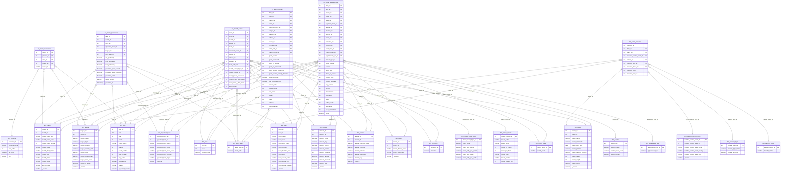

# Football Intelligence Platform

An end-to-end data engineering project powering **Krogvad Analytics Hub** — football intelligence for the whole world. The platform builds a dedicated analytics home for every league, each with its own identity, all on one shared data warehouse and refreshed every night. It runs the full modern-data-stack pipeline from raw API to live dashboard.

**Live →** [Krogvad Analytics Hub](https://krogvadanalyticshub.vercel.app/) — the front door to every league site, all built from this pipeline.

---

## Architecture

```
Sportmonks API   Highlightly API      Groq LLM      Poisson prediction model
       │                │                 │                    │
       └────────┬───────┴─────────────────┴────────────────────┘
                ▼
  Bronze layer        Raw JSON stored in MotherDuck (one table per endpoint,
                      per provider)
                       + LLM-generated match discussion rows
                       + pre-kickoff match predictions (frozen, never revised)
       │
       ▼
  Silver layer        Cleaned, typed, structured relational tables, each one
                      unioning every provider that carries the entity   (dbt)
       │
       ▼
  Gold layer          Kimball star schema  ─────────────────────────────┐
                      (dims + fct_team_matches                          │
                           + fct_player_appearances                     │
                           + fct_match_events                           │
                           + fct_match_predictions                      │
                           + fct_match_discussions                      │
                           + fct_team_transfers)  (dbt)                 │
                            │                                           ▼
                            │                             Evidence.dev dashboards
                            ▼                             (one app per league, plus the hub)
                  Public MotherDuck share                  deployed on Vercel
                  (read-only copy of gold)
```

The nightly GitHub Actions pipeline runs the four bronze producers in parallel (two API ingestions, LLM discussions, match predictions), then silver and gold sequentially with data-quality tests, then refreshes the public share and triggers a Vercel rebuild — so every site reflects last night's data.

---

## Tech stack

| Layer | Tool |
|---|---|
| Data sources | Sportmonks REST API · Highlightly REST API |
| Data warehouse | MotherDuck (DuckDB cloud) |
| Ingestion | Python (`ingestion/sportmonks/`, `ingestion/highlightly/`, `ingestion/groq/`, `ingestion/datascience/`) |
| Match predictions | In-house Poisson goals model (`ingestion/datascience/predict_match_outcomes.py`) |
| Transformations | dbt-duckdb (`dbt/`) |
| Orchestration | GitHub Actions (nightly + manual triggers) |
| BI / Dashboard | Evidence.dev (one app per league site, plus the hub) |
| Hosting | Vercel |

---

## Data model

The gold layer follows **Kimball dimensional modelling**. Six fact tables cover six business processes:

- **`fct_team_matches`** — one row per team per match (each fixture produces two rows, one per side); team-level stats, results, tactical data, extra-time and shootout goals, and expected goals where the provider carries them
- **`fct_player_appearances`** — one row per player per match; individual performance stats and ratings (~65 measures)
- **`fct_match_events`** — one row per in-match event (goal, card, substitution, VAR decision); event type/sub-type, minute on the match clock, running scoreline after the event, and per-group sequence — powering the Match Analysis timeline, league/team event-timing charts, team game-state (time leading/level/trailing) analysis, and referee VAR intelligence. Reloaded per fixture, since the provider rewrites a match's whole event list when VAR overturns a decision
- **`fct_match_predictions`** — one row per team per predicted fixture (mirroring `fct_team_matches` grain); pre-kickoff win/draw/loss probabilities, expected goals and expected points from the Poisson model, frozen three hours before kickoff and never revised — powering the Prediction Module page
- **`fct_match_discussions`** — one row per match per persona; LLM-generated fan discussion comments (via Groq) powering the Fan Forum on the Match Analysis page
- **`fct_team_transfers`** — one row per club per transfer; incoming/outgoing moves with fee, type, status, transfer partner, and player, powering the Transfer Intelligence page


```mermaid
erDiagram
    fct_team_matches {
        int date_sk FK
        int time_sk FK
        int match_sk FK
        int team_sk FK
        int opponent_team_sk FK
        int league_sk FK
        int stadium_sk FK
        int referee_sk FK
        int coach_sk FK
        int formation_sk FK
        int team_side_sk FK
        int match_result_sk FK
        int goals_scored
        int goals_conceded
        int goals_ht_scored
        int goals_ht_conceded
        int goals_scored_extra_time
        int goals_scored_penalty_shootout
        decimal expected_goals
        decimal ball_possession_pct
        int corner_kicks
        int yellow_cards
        int red_cards
        int saves
        int fouls
        int offsides
        int points_earned
    }

    fct_player_appearances {
        int date_sk FK
        int time_sk FK
        int match_sk FK
        int player_sk FK
        int team_sk FK
        int opponent_team_sk FK
        int league_sk FK
        int stadium_sk FK
        int referee_sk FK
        int coach_sk FK
        int formation_sk FK
        int position_sk FK
        int team_side_sk FK
        int match_result_sk FK
        int appearance_type_sk FK
        int minutes_played
        int goals_scored
        int assists
        int shots_total
        int shots_on_target
        int passes_total
        int passes_accurate
        int key_passes
        int tackles
        int interceptions
        int clearances
        int saves
        int yellow_cards
        int red_cards
        int fouls_committed
        decimal rating
    }

    fct_match_events {
        int date_sk FK
        int time_sk FK
        int match_sk FK
        int league_sk FK
        int team_sk FK
        int opponent_team_sk FK
        int player_sk FK
        int referee_sk FK
        int stadium_sk FK
        int team_side_sk FK
        int match_event_type_sk FK
        int match_minute_sk FK
        int event_group_sequence
        int home_score_after_event
        int away_score_after_event
        int event_count
    }

    dim_date {
        int date_sk PK
        date date
        int year
        int month
        varchar month_name
        int quarter
        int week_number
        int day_of_week
        varchar day_name
        boolean is_weekend
        varchar season
        boolean is_current_season
    }

    dim_time {
        int time_sk PK
        int hour
        varchar period_of_day
    }

    dim_match {
        int match_sk PK
        int match_id
        varchar match_round_type
        varchar match_round_name
        int match_round_number
        varchar match_name
        varchar match_short_name
        varchar match_type
        varchar match_status
        varchar match_result
        varchar kick_off_time
        varchar _source
    }

    dim_match_event_type {
        int match_event_type_sk PK
        varchar event_group
        varchar event_type_name
        varchar event_sub_type_name
        varchar event_type_code
        varchar event_sub_type_code
    }

    dim_match_minute {
        int match_minute_sk PK
        varchar minute_label
        varchar period_name
        int minute_of_match
        int stoppage_offset
        varchar minute_type
        varchar minute_bucket
        int minute_bucket_sort
    }

    dim_team {
        int team_sk PK
        int team_id
        varchar team_name
        varchar team_code
        varchar team_short_name
        varchar team_country
        int team_founded_year
        varchar team_logo
        varchar team_venue_name
        varchar team_venue_city
        int team_venue_capacity
        varchar _source
    }

    dim_opponent_team {
        int opponent_team_sk PK
        int opponent_team_id
        varchar opponent_team_name
        varchar opponent_team_code
        varchar opponent_team_short_name
        varchar opponent_team_country
        varchar opponent_team_logo
        varchar _source
    }

    dim_league {
        int league_sk PK
        int league_id
        varchar league_name
        varchar league_type
        varchar league_country
        varchar league_country_code
        varchar league_logo
        varchar league_country_flag
        varchar league_short_code
        boolean league_is_active
        varchar _source
    }

    dim_stadium {
        int stadium_sk PK
        int stadium_id
        varchar stadium_name
        varchar stadium_city
        varchar stadium_country
        varchar stadium_surface
        int stadium_capacity
        decimal stadium_latitude
        decimal stadium_longitude
        varchar stadium_key
        varchar _source
    }

    dim_referee {
        int referee_sk PK
        int referee_id
        varchar referee_common_name
        varchar referee_firstname
        varchar referee_lastname
        varchar referee_nationality
        varchar referee_key
        varchar _source
    }

    dim_coach {
        int coach_sk PK
        int coach_id
        varchar coach_display_name
        varchar coach_nationality
        varchar _source
    }

    dim_formation {
        int formation_sk PK
        varchar formation
    }

    dim_player {
        int player_sk PK
        int player_id
        varchar player_name
        varchar player_nationality
        date player_birth_date
        varchar player_position
        varchar player_detailed_position
        int player_height
        int player_weight
        varchar player_photo
        varchar _source
    }

    dim_position {
        int position_sk PK
        varchar position_name
        varchar position_short_code
        varchar position_group
    }

    dim_team_side {
        int team_side_sk PK
        varchar team_side
    }

    dim_match_result {
        int match_result_sk PK
        varchar match_result
    }

    dim_appearance_type {
        int appearance_type_sk PK
        varchar appearance_type
    }

    dim_persona {
        int persona_sk PK
        varchar persona_name
        int sort_order
        boolean is_active
        varchar bio
    }

    fct_match_discussions {
        int match_sk FK
        int persona_sk FK
        int date_sk FK
        int league_sk FK
        varchar message
    }

    dim_transfer_type {
        int transfer_type_sk PK
        varchar transfer_type_name
        varchar transfer_direction
    }

    dim_transfer_status {
        int transfer_status_sk PK
        varchar transfer_status
    }

    dim_transfer_partner_team {
        int transfer_partner_team_sk PK
        int transfer_partner_team_id
        varchar transfer_partner_team_name
        varchar transfer_partner_team_country
        varchar transfer_partner_team_logo
        varchar _source
    }

    fct_team_transfers {
        int transfer_id
        int date_sk FK
        int team_sk FK
        int transfer_partner_team_sk FK
        int player_sk FK
        int transfer_type_sk FK
        int transfer_status_sk FK
        int transfer_count
        int transfer_fee_eur
    }

    fct_match_predictions {
        int date_sk FK
        int match_sk FK
        int team_sk FK
        int opponent_team_sk FK
        int league_sk FK
        int team_side_sk FK
        decimal win_probability
        decimal draw_probability
        decimal loss_probability
        decimal predicted_goals_scored
        decimal predicted_goals_conceded
        decimal predicted_points
        varchar model_version
        timestamp predicted_at
    }

    fct_team_matches }o--|| dim_date : "date_sk"
    fct_team_matches }o--|| dim_time : "time_sk"
    fct_team_matches }o--|| dim_match : "match_sk"
    fct_team_matches }o--|| dim_team : "team_sk"
    fct_team_matches }o--|| dim_opponent_team : "opponent_team_sk"
    fct_team_matches }o--|| dim_league : "league_sk"
    fct_team_matches }o--|| dim_stadium : "stadium_sk"
    fct_team_matches }o--|| dim_referee : "referee_sk"
    fct_team_matches }o--|| dim_coach : "coach_sk"
    fct_team_matches }o--|| dim_formation : "formation_sk"
    fct_team_matches }o--|| dim_team_side : "team_side_sk"
    fct_team_matches }o--|| dim_match_result : "match_result_sk"
    fct_player_appearances }o--|| dim_date : "date_sk"
    fct_player_appearances }o--|| dim_time : "time_sk"
    fct_player_appearances }o--|| dim_match : "match_sk"
    fct_player_appearances }o--|| dim_player : "player_sk"
    fct_player_appearances }o--|| dim_team : "team_sk"
    fct_player_appearances }o--|| dim_opponent_team : "opponent_team_sk"
    fct_player_appearances }o--|| dim_league : "league_sk"
    fct_player_appearances }o--|| dim_stadium : "stadium_sk"
    fct_player_appearances }o--|| dim_referee : "referee_sk"
    fct_player_appearances }o--|| dim_coach : "coach_sk"
    fct_player_appearances }o--|| dim_formation : "formation_sk"
    fct_player_appearances }o--|| dim_position : "position_sk"
    fct_player_appearances }o--|| dim_team_side : "team_side_sk"
    fct_player_appearances }o--|| dim_match_result : "match_result_sk"
    fct_player_appearances }o--|| dim_appearance_type : "appearance_type_sk"
    fct_match_events }o--|| dim_date : "date_sk"
    fct_match_events }o--|| dim_time : "time_sk"
    fct_match_events }o--|| dim_match : "match_sk"
    fct_match_events }o--|| dim_league : "league_sk"
    fct_match_events }o--|| dim_team : "team_sk"
    fct_match_events }o--|| dim_opponent_team : "opponent_team_sk"
    fct_match_events }o--|| dim_player : "player_sk"
    fct_match_events }o--|| dim_referee : "referee_sk"
    fct_match_events }o--|| dim_stadium : "stadium_sk"
    fct_match_events }o--|| dim_team_side : "team_side_sk"
    fct_match_events }o--|| dim_match_event_type : "match_event_type_sk"
    fct_match_events }o--|| dim_match_minute : "match_minute_sk"
    fct_match_discussions }o--|| dim_match : "match_sk"
    fct_match_discussions }o--|| dim_persona : "persona_sk"
    fct_match_discussions }o--|| dim_date : "date_sk"
    fct_match_discussions }o--|| dim_league : "league_sk"
    fct_team_transfers }o--|| dim_date : "date_sk"
    fct_team_transfers }o--|| dim_team : "team_sk"
    fct_team_transfers }o--|| dim_transfer_partner_team : "transfer_partner_team_sk"
    fct_team_transfers }o--|| dim_player : "player_sk"
    fct_team_transfers }o--|| dim_transfer_type : "transfer_type_sk"
    fct_team_transfers }o--|| dim_transfer_status : "transfer_status_sk"
    fct_match_predictions }o--|| dim_date : "date_sk"
    fct_match_predictions }o--|| dim_match : "match_sk"
    fct_match_predictions }o--|| dim_team : "team_sk"
    fct_match_predictions }o--|| dim_opponent_team : "opponent_team_sk"
    fct_match_predictions }o--|| dim_league : "league_sk"
    fct_match_predictions }o--|| dim_team_side : "team_side_sk"
```

Measures are abridged above: `fct_team_matches` carries ~50 team measures and `fct_player_appearances` ~65 player measures in full.

### Dimensional model bus matrix

The bus matrix shows which dimensions are conformed (shared) across business processes — the foundation of Kimball integration.

| **BUSINESS PROCESSES →** | Team Match Performance | Player Appearance | Match Events | Match Prediction | Match Discussion | Team Transfers |
|---|:---:|:---:|:---:|:---:|:---:|:---:|
| **COMMON DIMENSIONS ↓** | | | | | | |
| Date | X | X | X | X | X | X |
| Time of Day | X | X | X | | | |
| Match | X | X | X | X | X | |
| Team | X | X | X | X | | X |
| Opponent Team | X | X | X | X | | |
| League | X | X | X | X | X | |
| Stadium / Venue | X | X | X | | | |
| Referee | X | X | X | | | |
| Coach | X | X | | | | |
| Formation | X | X | | | | |
| Home / Away | X | X | X | X | | |
| Match Result | X | X | | | | |
| Player | | X | X | | | X |
| Playing Position | | X | | | | |
| Appearance Type | | X | | | | |
| Match Event Type | | | X | | | |
| Match Minute | | | X | | | |
| Persona | | | | | X | |
| Transfer Type | | | | | | X |
| Transfer Status | | | | | | X |
| Transfer Partner | | | | | | X |

All dimension surrogate keys are **stable across runs** — new records get new SKs, existing records keep theirs. Sentinel rows (`-1 Unknown`, `-2 Not Applicable`) handle missing lookups, with all VARCHAR attributes filled with descriptive defaults (e.g. `'Unknown Stadium Country'`). Every `dim_*` table therefore has two more rows than it has real entities.

Because gold is the product — every mart reads it, and surrogate keys live in incremental dimensions that must never be rebuilt — gold changes ship with evidence from `scripts/gold_verify.py`: snapshot prod gold, run the change locally, diff row counts, key stability and column values before it reaches a PR.

---

## Dashboards

Every site is its own Evidence.dev app. They share the warehouse, the component library and the design language, but each league site has its own identity (country-coloured logo, hero and accent palette).

**Hub** — the group front door: a spinning globe highlighting covered countries, the story of the group, live group-wide counters sourced from the dimensions, and a shelf linking every league site.

**League sites** — each ships the same core page set, plus a persistent side pane (hideable) and a mobile bottom bar for navigation, an installable PWA manifest, and a shared footer showing data freshness.

| Page | Description |
|---|---|
| **Home** | Season KPIs, current leader, and navigation |
| **Standings** | Full table plus whatever split, group or playoff structure the league uses |
| **Match Results** | Results by round with scorelines and Players of the Week |
| **Match Analysis** | Per-match deep dive: formation-true lineup pitch with player ratings and stats, match timeline, team stats, head-to-head, and the LLM-generated Fan Forum |
| **Upcoming Fixtures** | Next fixtures with head-to-head history, last-5 form guide, and local kick-off times |
| **Upcoming Match Analysis** | Pre-match preview: head-to-head record, form, and the model's view with expected goals |
| **Prediction Module** | The match model's track record: cumulative points race (actual & projected, drawn even before a season starts), upcoming predictions with probabilities and expected goals, accuracy by round, and the full prediction history — every prediction frozen before kickoff |
| **League Intelligence** | Season awards podium, standings race, cross-team landscape and radar benchmarks, per-domain team rankings, and "The Rhythm of a Match" — when goals and cards land across the match clock league-wide |
| **Team Intelligence** | Per-team KPIs, form, performance vs previous season, shooting and possession breakdowns, event-timing profile (when this team plays best / concedes), and game-state analysis (time spent leading, level and trailing, plus comebacks) |
| **About** | Project background, stack overview, and the build journey |
| **Data Glossary** | Definitions of all metrics and KPIs used across the dashboard |

Sites whose provider history runs deep enough additionally ship these pages:

| Page | Description |
|---|---|
| **Referee Intelligence** | Cards and fouls by referee, strictness rankings, VAR decisions (who VAR ruled against), and per-match discipline logs |
| **Stadium Intelligence** | Interactive stadium map, fortress rankings, and home-advantage stats |
| **Player Intelligence** | League top-player podium by any measure, individual player deep dive with profile, characteristics radar, performance timeline, and match log |
| **Transfer Intelligence** | Club transfer market: spend KPIs, record signing & sale, transfer volume and count by team, market trend over time, and a searchable transfer ledger — filterable by year, window, team, direction, type, status and fee disclosure |

Marts are many small, purpose-built SQL sources rather than a few shared ones: each is pre-aggregated at build time into a parquet cache, so the browser does no aggregation work.

---

## Project structure

```
.
├── ingestion/
│   ├── sportmonks/             # Bronze: pull from Sportmonks API → MotherDuck
│   │   ├── run.py              # Ingestion runner (incremental + full load)
│   │   ├── engine.py           # Metadata-driven fetch engine
│   │   ├── api.py              # Sportmonks API client
│   │   ├── db.py               # MotherDuck connection
│   │   └── config.py           # Endpoint manifest + env vars
│   ├── highlightly/            # Bronze: pull La Liga / Liga MX / Süper Lig from Highlightly API
│   │   ├── run.py              # Ingestion runner (rolling window / backfill)
│   │   ├── engine.py           # List + detail passes, budget-aware
│   │   ├── api.py              # Highlightly API client (daily-quota steering)
│   │   ├── db.py               # Bronze tables + resumable-work queries
│   │   └── config.py           # Leagues, seasons, budget constants
│   ├── groq/                   # Bronze: LLM match discussion generation
│   │   └── generate_round_discussions.py  # Groq API → fct_match_discussions
│   └── datascience/            # Bronze: pre-kickoff match predictions
│       ├── predict_match_outcomes.py      # Poisson goals model → win/draw/loss probs
│       └── README.md           # Prediction contract (freeze rules, schema)
│
├── dbt/                        # Silver + Gold transformations (dbt-duckdb)
│   ├── models/
│   │   ├── silver/             # 39 models: bronze JSON → structured tables,
│   │   │                       #   unioned across providers, keyed on (id, _source)
│   │   └── gold/
│   │       ├── dims/           # 21 dim_* models (Kimball dims)
│   │       ├── fct_team_matches.sql
│   │       ├── fct_player_appearances.sql
│   │       ├── fct_match_events.sql
│   │       ├── fct_match_predictions.sql
│   │       ├── fct_match_discussions.sql
│   │       └── fct_team_transfers.sql
│   ├── seeds/                  # Display names, provider stat-code maps,
│   │                           #   and curated data-correction overrides
│   ├── tests/                  # Custom SQL DQ assertions (silver + gold)
│   ├── macros/                 # League-agnostic helpers (timezone, match scope,
│   │                           #   round-type conformance, incremental filters)
│   └── dbt_project.yml
│
├── dashboards/                 # Evidence.dev BI apps (one per site)
│   ├── hub/                    # Krogvad Analytics Hub — group front door
│   │   ├── components/         #   Globe.svelte + generated globe-data.js, side nav
│   │   ├── scripts/            #   sync_league_logos.py
│   │   └── sources/hub/        #   League summary, group counters, freshness
│   ├── superligaen/            # Danish Superliga site (full page set)
│   │   ├── pages/              #   One .md file per dashboard page
│   │   ├── sources/            #   SQL marts queried at build time (parquet cache)
│   │   └── components/         #   Shared Svelte components (lineup pitch, timeline,
│   │                           #     radar, side nav, bottom nav, footer …)
│   ├── scotland/               # Scottish Premiership site (full page set)
│   ├── ligamx/                 # Liga MX site (core page set)
│   ├── turkey/                 # Süper Lig site (core page set)
│   └── spain/                  # La Liga site (core page set)
│
├── scripts/
│   ├── push_to_prod.py         # Push local DuckDB → MotherDuck (schema-selective)
│   ├── pull_from_prod.py       # Pull MotherDuck → local DuckDB
│   ├── gold_verify.py          # Snapshot/diff gold to prove a change did what it should
│   ├── refresh_share.py        # Mirror prod gold → the public share database
│   └── generate_globe_data.py  # Regenerate the hub globe geometry (run on roster change)
│
├── .github/workflows/
│   ├── master.yml              # Nightly: bronze (2 APIs + discussions + predictions
│   │                           #   in parallel) → silver → gold → DQ → share → deploy
│   ├── ci.yml                  # PR validation: Python syntax + dbt compile
│   ├── bronze.yml              # Manual bronze-only run (Sportmonks)
│   ├── highlightly.yml         # Manual bronze-only run (Highlightly, budget-aware)
│   ├── silver.yml              # Manual silver-only run (dbt)
│   ├── gold.yml                # Manual gold-only run (dbt)
│   ├── discussions.yml         # Manual LLM discussion generation
│   ├── predictions.yml         # Manual match prediction run
│   ├── dq.yml                  # Manual DQ test run
│   ├── share.yml               # Manual public-share refresh
│   └── vercel.yml              # Manual Vercel deploy trigger
│
└── requirements.txt
```

---

## Nightly pipeline

`master.yml` runs at 23:00 UTC, after the evening's matches finish, and is also dispatchable with a full-load flag.

| Stage | Jobs | Notes |
|---|---|---|
| Bronze | 4 jobs in parallel | Two API ingestions plus LLM discussions and match predictions. The second API runs on a free 100-calls/day plan: it steers by the quota header, stops cleanly when the budget runs out and resumes the next night |
| Silver | 1 job | Blocks only on the primary ingest — a failed discussion, prediction or secondary-provider run shows red but doesn't stop the pipeline; that data just stays stale |
| Gold | 1 job | Incremental by default (`INCREMENTAL_DAYS_BACK=7`), full-refresh on demand |
| DQ | 1 job | `dbt test` + `dbt source freshness`; a failure blocks publish |
| Share | 1 job | Rebuilds the public share from prod gold |
| Publish | 1 job | Force-pushes `publish_dashboard/vercel`, which is the only branch Vercel builds from |

Each manual workflow mirrors exactly one nightly job, so any stage can be re-run in isolation against either database.

---

## Public data share

Gold is mirrored nightly into a separate MotherDuck database (`superligaen_share`) and handed out read-only. MotherDuck shares are database-wide, so gold gets its own database rather than exposing bronze and silver alongside it; views are materialised as tables, since a view carries a reference to the database it was built in that a recipient cannot resolve. Objects are discovered from the catalog, so a new gold model joins the share — and therefore becomes public — the night after it ships.

---

## Environments

| Environment | MotherDuck database | dbt target | Triggered by |
|---|---|---|---|
| Dev | `superligaen_dev` (local DuckDB) | `dev` | Local / feature branches |
| Prod | `superligaen` | `prod` | GitHub Actions (`main`) |
| Public share | `superligaen_share` (gold only) | — | Nightly, after DQ passes |

Dev runs against a local `superligaen_dev.duckdb` file. Use `scripts/push_to_prod.py` to push local data to MotherDuck dev for dashboard testing.

---

## Local setup

```bash
# 1. Clone and create a feature branch
git clone https://github.com/SaUgKi1773/data-engineering-demo.git
git checkout -b dev/<your-feature>

# 2. Create virtual environment
python3.11 -m venv .venv
source .venv/bin/activate
pip install -r requirements.txt

# 3. Configure environment
cp .env.example .env
# Fill in MOTHERDUCK_TOKEN, SPORTMONKS_API_KEY, HIGHLIGHTLY_API_KEY, GROQ_API_KEY
# and TARGET_DB (superligaen or superligaen_dev)

# 4. Run layers against local dev
python ingestion/sportmonks/run.py
python ingestion/highlightly/run.py --days-back 7
cd dbt
dbt seed --target dev
dbt run --select silver.* --target dev
dbt run --select gold.* --target dev

# 5. Push to MotherDuck dev for dashboard testing
cd ..
python scripts/push_to_prod.py --db superligaen_dev --schema silver gold

# 6. Run a dashboard locally (any folder under dashboards/)
cd dashboards/superligaen
npm install
npm run sources   # regenerates parquet cache from MotherDuck
npm run dev
# → http://localhost:3000
```

Note: dropdowns and other option lists are populated from the built parquet cache, so verify them with `npm run build && npm run preview` — dev mode can show stale options.

---

## GitHub Actions secrets

| Secret | Description |
|---|---|
| `MOTHERDUCK_TOKEN` | MotherDuck service token (read-write) |
| `MOTHERDUCK_TOKEN_READONLY` | MotherDuck read-only token (dashboard build) |
| `SPORTMONKS_API_KEY` | Sportmonks API key |
| `HIGHLIGHTLY_API_KEY` | Highlightly API key |
| `GROQ_API_KEY` | Groq API key (LLM match discussion generation) |
